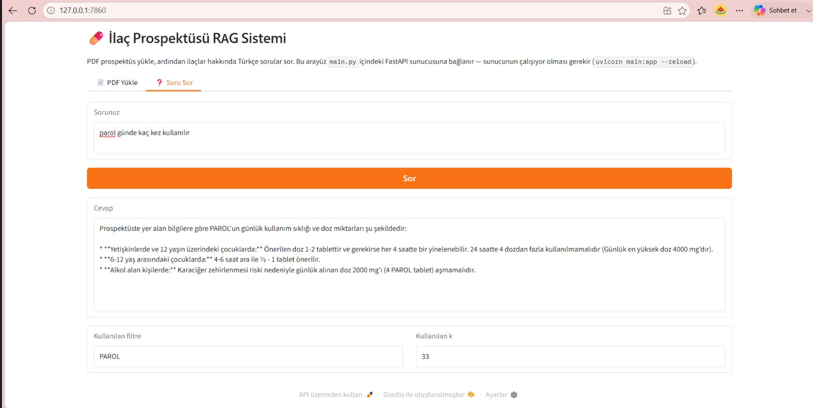

# 💊 Medicine RAG: AI-Powered Q&A for Package Inserts

<div align="center">


[](https://github.com/ozdogrumerve/medicine-rag/network)
[](https://github.com/ozdogrumerve/medicine-rag/issues)

**An intelligent RAG system that transforms medicine package inserts into an interactive Q&A platform, powered by Gemini AI and FastAPI.**

</div>

## 📖 Overview

The Medicine RAG project offers a robust Retrieval-Augmented Generation (RAG) system designed to answer questions based on the content of medicine package inserts (prospectuses). It leverages natural language processing and vector search capabilities to provide accurate and contextually relevant information.

Users can upload PDF documents containing package inserts. The system then processes these documents by chunking their content, embedding them into a numerical vector space, and storing them in a FAISS index for efficient semantic search. When a question is posed, the system detects the relevant drug from the question, retrieves the most relevant passages from that document, and synthesizes an answer using the Google Gemini API.

The project provides both a RESTful API built with FastAPI for programmatic access and an interactive web interface built with Gradio for demonstration purposes. This makes it an ideal solution for researchers, healthcare professionals, or anyone needing quick, reliable information from medical documentation.

## 🖼️ Demo

<div align="center">



</div>

## ✨ Features

-   **PDF Document Processing**: Upload medicine package inserts in PDF format.
-   **Intelligent Document Chunking**: Automatically breaks down large documents into manageable, overlapping chunks to preserve context.
-   **Semantic Search (FAISS)**: Utilizes FAISS for fast vector similarity search to retrieve relevant document segments.
-   **Source-Based Filtering**: Automatically detects which drug a question refers to and narrows the search to that document, improving accuracy across a multi-document knowledge base.
-   **Gemini API Integration**: Leverages Google's Gemini API for generating coherent and accurate answers.
-   **Contextual Q&A**: Answers questions based *only* on the provided document content, minimizing hallucinations.
-   **FastAPI Backend**: Provides a lightweight, easy-to-test API for RAG operations.
-   **Gradio Web UI**: An easy-to-use, interactive web interface for uploading PDFs and asking questions.
-   **Environment Configuration**: Supports flexible configuration via environment variables.

## 🛠️ Tech Stack

**Backend:**

[](https://www.python.org/)

[](https://fastapi.tiangolo.com/)

[](https://www.uvicorn.org/)

[](https://ai.google.dev/)

[](https://github.com/facebookresearch/faiss)

[](https://www.sbert.net/)

[](https://pypdf.readthedocs.io/en/stable/)

[](https://github.com/theskumar/python-dotenv)

**Frontend (Interactive UI):**

[](https://www.gradio.app/)

## 🚀 Quick Start

Follow these steps to get the Medicine RAG system up and running on your local machine.

### Prerequisites

-   **Python 3.10+** (ensure it's installed and available in your PATH)
-   A **Google Gemini API Key** for accessing the Generative AI models.

### Installation

1.  **Clone the repository**
    ```bash
    git clone https://github.com/ozdogrumerve/medicine-rag.git
    cd medicine-rag
    ```

2.  **Create and activate a virtual environment** (recommended)
    ```bash
    python -m venv venv
    # On Windows
    .\venv\Scripts\activate
    # On macOS/Linux
    source venv/bin/activate
    ```

3.  **Install dependencies**
    ```bash
    pip install -r requirements.txt
    ```

4.  **Environment setup**
    Create a `.env` file in the root directory of the project and add your Google Gemini API Key:
    ```
    GEMINI_API_KEY=YOUR_GOOGLE_GEMINI_API_KEY
    ```
    You can get your API key from [Google AI Studio](https://aistudio.google.com/apikey).

### Running the Application

You have two main options to interact with the RAG system: using the FastAPI backend directly or through the Gradio web UI.

#### Option 1: Run FastAPI Backend (API only)

To run the FastAPI server, which exposes API endpoints for PDF upload and Q&A:

```bash
uvicorn main:app --reload
```
The API will be available at `http://127.0.0.1:8000`. You can access the interactive API documentation (Swagger UI) at `http://127.0.0.1:8000/docs`.

#### Option 2: Run Gradio Web UI (Interactive Application)

To run the Gradio web interface, which includes both PDF upload and Q&A capabilities:

```bash
python gradio_app.py
```
The Gradio application will typically open in your browser at `http://localhost:7860` (or another port if 7860 is busy).

### Initial Data Setup

Before asking questions, you need to provide PDF documents.
1.  When running the Gradio app, you can **upload PDFs directly through the UI**.
2.  If using the FastAPI backend directly, use the `/upload` endpoint to submit your PDF files.

The system automatically processes these PDFs: it extracts the text, splits it into overlapping chunks, embeds them, and adds them to a FAISS vector store persisted in the `veritabani/` directory. Each chunk is tagged with the drug name (derived from the file name) so that later questions can be filtered to the right document.

## 📁 Project Structure

```
medicine-rag/
├── assets/
│   └── demo.png           # Screenshot(s) used in the README
├── data/
│   └── prospectus/        # Uploaded PDF files are stored here
├── veritabani/            # Auto-generated FAISS index + chunk store (ignored by Git)
├── .gitignore             # Specifies intentionally untracked files to ignore
├── main.py                # FastAPI application entry point, defines API endpoints
├── rag.py                 # Core RAG logic: PDF parsing, chunking, embedding, FAISS, LLM interaction
├── gradio_app.py          # Gradio web interface for interactive Q&A
└── requirements.txt       # Python dependencies for the project
```

## 📚 API Reference (FastAPI Backend)

The FastAPI backend provides the following endpoints:

### `/upload`

Uploads a PDF file, processes it, and adds its content to the RAG knowledge base.

-   **URL**: `/upload`
-   **Method**: `POST`
-   **Request Body**: `form-data` with a file field named `dosya`.
-   **Response**:
    ```json
    {
      "mesaj": "NUROFEN.pdf başarıyla yüklendi ve işlendi",
      "eklenen_parca_sayisi": 27,
      "toplam_parca_sayisi": 200
    }
    ```

### `/ask`

Asks a question against the loaded knowledge base and receives an AI-generated answer. If the question mentions a drug name that has already been uploaded, the search is automatically restricted to that document for higher accuracy.

-   **URL**: `/ask`
-   **Method**: `POST`
-   **Request Body**: `application/json`
    ```json
    {
      "soru": "NUROFEN nedir?"
    }
    ```
-   **Response**:
    ```json
    {
      "soru": "NUROFEN nedir?",
      "cevap": "Prospektüste yer alan bilgilere göre NUROFEN, her bir kaplı tableti 200 mg ibuprofen içeren bir ilaçtır...",
      "kullanilan_filtre": "NUROFEN",
      "kullanilan_k": 27
    }
    ```

## ⚙️ Configuration

### Environment Variables

| Variable       | Description                      | Default | Required |
| :------------- | :------------------------------- | :------ | :------- |
| `GEMINI_API_KEY` | Your Google Gemini API Key. | `None`  | Yes      |

## 🙏 Acknowledgments

-   **FastAPI**: For providing a modern, fast (high-performance) web framework for building APIs.
-   **Google Gemini API**: For its generative AI capabilities.
-   **FAISS**: For efficient similarity search and clustering of dense vectors.
-   **Sentence Transformers**: For local, multilingual text embeddings.
-   **Gradio**: For enabling rapid creation of shareable machine learning demos.
-   **PyPDF**: For PDF text extraction.

## 📞 Support & Contact

If you have any questions, suggestions, or encounter issues, please feel free to:

-   🐛 Open an issue on [GitHub Issues](https://github.com/ozdogrumerve/medicine-rag/issues).

---

<div align="center">

*Powered by AI, fueled by everyone's refusal to read the side effects section. 💊*

**⭐ Star this repo if you find it helpful!**

Made with ❤️ by [ozdogrumerve](https://github.com/ozdogrumerve)

</div>
